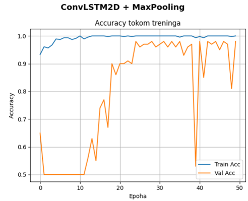
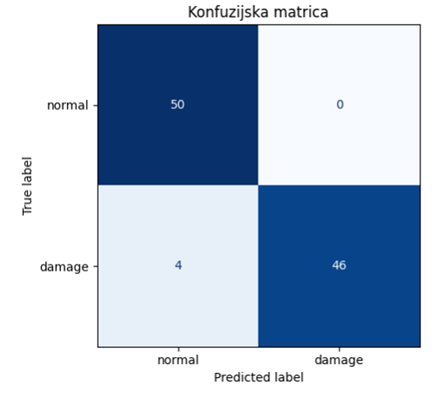
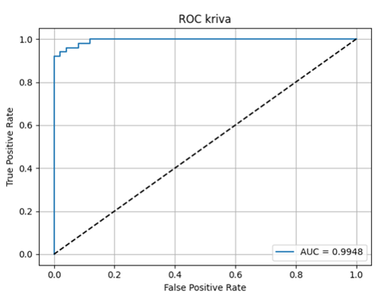
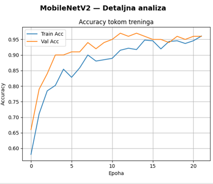
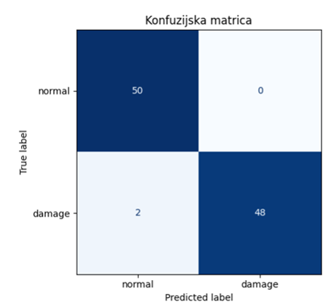
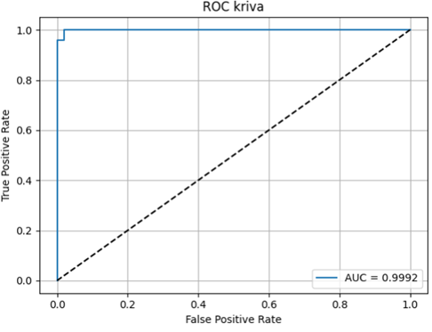

# Road Anomaly Detection (ConvLSTM2D & MobileNetV2 + LSTM)

Binary classification of road-surface video sequences (**normal** vs **damage**) using deep learning on spatio-temporal data. The project compares a custom **ConvLSTM2D** architecture against a **transfer-learning approach (MobileNetV2 + LSTM)**, tuning optimizers, batch size, layer width, and activation functions along the way.

## Problem

Each input sample is a short video clip — a sequence of `20` frames (`64×64` RGB) — representing a segment of road. The model predicts whether that segment shows visible road damage (potholes, cracks, anomalies) or a normal road surface.

- **Classes:** `normal` (0), `damage` (1)
- **Input shape:** `(20, 64, 64, 3)` per sample (sequence length × height × width × channels)
- **Test set:** 100 samples, perfectly balanced (50 / 50)

## Dataset

The training data combines a subset of the [Road Anomaly Detection dataset (Mendeley Data)](https://data.mendeley.com/datasets/8chk8vdn2z/3) with additional road video clips recorded manually, then split into fixed-length frame sequences and labeled `normal` / `damage`.

## Approach

Two model families were built and tuned:

### 1. ConvLSTM2D (from scratch)
A `ConvLSTM2D` layer processes the frame sequence directly, followed by batch normalization, a dense head with L2 regularization, and dropout to fight overfitting on a small dataset.

### 2. MobileNetV2 + LSTM (transfer learning)
Each frame is passed through a frozen, ImageNet-pretrained `MobileNetV2` (via `TimeDistributed` + `GlobalAveragePooling2D`) to extract spatial features, and an `LSTM` layer models the temporal relationship between frames before a dense classification head.

For both families, a small grid search was run over optimizer (Adam / SGD / RMSprop), learning rate, batch size, layer width, and activation function, using class weighting to handle any class imbalance and early stopping / LR reduction on plateau to control training.

## Results

### ConvLSTM2D — hyperparameter sweep

| Experiment | Optimizer | LR | Batch | Test Acc | ROC-AUC |
|---|---|---|---|---|---|
| Baseline | Adam | 1e-3 | 8 | 0.88 | 0.982 |
| Adam lr=1e-4 | Adam | 1e-4 | 8 | 0.95 | 0.980 |
| SGD | SGD | 1e-3 | 8 | 0.89 | 0.948 |
| RMSprop | RMSprop | 1e-3 | 8 | 0.90 | 0.985 |
| Batch=16 | Adam | 1e-3 | 16 | 0.96 | 0.956 |
| Batch=32 | Adam | 1e-3 | 32 | 0.95 | 0.960 |
| Dense=64 | Adam | 1e-3 | 8 | 0.92 | 0.967 |
| **ReLU activation** | Adam | 1e-3 | 8 | **0.98** | **0.984** |

An improved, better-regularized ConvLSTM2D version (wider filters, lower LR, ReduceLROnPlateau) reached **0.98 test accuracy / 0.995 ROC-AUC**.

### MobileNetV2 + LSTM — hyperparameter sweep

| Experiment | Optimizer | LR | Batch | Test Acc | ROC-AUC |
|---|---|---|---|---|---|
| Baseline | Adam | 1e-3 | 8 | 0.91 | 0.976 |
| **Adam lr=1e-4** | Adam | 1e-4 | 8 | **0.98** | **0.998** |
| SGD | SGD | 1e-3 | 8 | 0.94 | 0.952 |
| RMSprop | RMSprop | 1e-3 | 8 | 0.98 | 0.988 |
| Batch=16 | Adam | 1e-3 | 16 | 0.96 | 0.957 |
| Batch=32 | Adam | 1e-3 | 32 | 0.95 | 0.982 |
| Dense=64 | Adam | 1e-3 | 8 | 0.97 | 0.971 |
| ReLU activation | Adam | 1e-3 | 8 | 0.96 | 0.989 |

**Best overall result: MobileNetV2 + LSTM, Adam @ lr=1e-4 → 98% test accuracy, 0.998 ROC-AUC**, with perfect recall on the `normal` class and 96% recall on `damage`.

Each experiment also reports a full classification report, confusion matrix, training curves, and ROC curve (see the notebooks).

### Visualizations

**ConvLSTM2D + MaxPooling**

| Training curve | Confusion matrix | ROC curve |
|---|---|---|
|  |  |  |

Confusion matrix shows 50/50 correct on `normal`, 46/50 correct on `damage` (4 false negatives), with **AUC = 0.9948**.

**MobileNetV2 + LSTM**

| Training curve | Confusion matrix | ROC curve |
|---|---|---|
|  |  |  |

Confusion matrix shows 50/50 correct on `normal`, 48/50 correct on `damage` (2 false negatives), with **AUC = 0.9992**.

## Tech stack

- Python, TensorFlow / Keras
- ConvLSTM2D, MobileNetV2 (transfer learning), LSTM
- scikit-learn (metrics, class weighting, train/test split)
- NumPy, OpenCV, Matplotlib, pandas
- Originally developed and trained on Google Colab (GPU runtime)

## Repository structure

```
notebooks/
  01_convlstm_baseline_experiments.ipynb   # ConvLSTM2D grid search + first MobileNetV2 pass
  02_mobilenet_lstm_experiments.ipynb      # MobileNetV2 + LSTM tuning, ConvLSTM2D refinements
requirements.txt
```

## Running the notebooks

The notebooks were built for Google Colab and expect the preprocessed dataset (`X_train.npy`, `y_train.npy`, `X_val.npy`, `y_val.npy`, `X_test.npy`, `y_test.npy`) to be available (originally on Google Drive). To run locally:

1. `pip install -r requirements.txt`
2. Point `save_path` / `DATASET_DIR` in the first cells to your local copy of the preprocessed `.npy` arrays.
3. Run the cells top to bottom (or open in Colab and mount your own Drive).

## Notes

- Dataset preprocessing (raw video → labeled frame sequences → `.npy` arrays) is not included in this repo, only the modeling/training notebooks.
- Raw video data (Mendeley subset + manually recorded clips) is not included in this repo; only the training/evaluation notebooks are provided.
- Model/prediction artifacts (`.h5`, `.npy` prediction caches) are excluded — see `.gitignore`.
